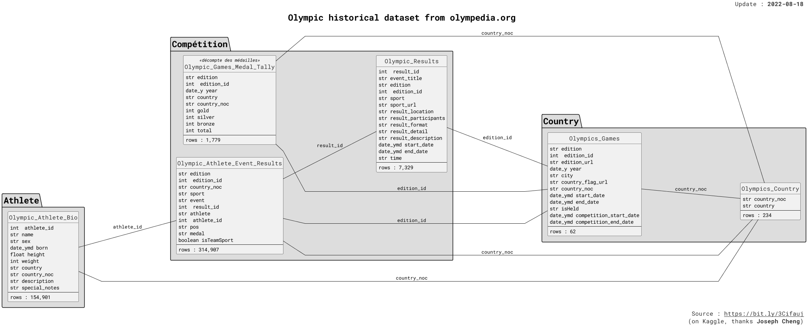

# Olympic Games Dataset Analysis

## Overview

This project presents an analysis of the Olympic Games dataset, which includes information on various Olympic events, athletes, and results. The goal of this analysis was to extract insights and patterns from the data to better understand trends and performances across different Olympic Games.

## Dataset

### Source
[Olympic Historical Dataset (1896 - 2022)](https://www.kaggle.com/datasets/muhammadehsan000/olympic-historical-dataset-1896-2020) by Muhammad Ehsan.

## Analysis

### Overview

#### Total Number of Athletes
- **Total:** 155,861

#### Number of Athletes by Sex
- **Male Athletes:** 115,527
- **Female Athletes:** 40,334

#### Average Height by Sex
| sex    | avg_height |
|--------|------------|
| Female | 168.91 cm  |
| Male   | 179.52 cm  |

#### Total Number of Players 200 cm Tall or Higher
- **Total:** 1,566

---

### Athlete and Medal Statistics

#### Most Gold Medals by Athlete
| athlete         | gold_medals |
|-----------------|-------------|
| Michael Phelps  | 23          |
| Carl Lewis      | 9           |
| Larisa Latynina | 9           |

#### Most Medals (Gold + Silver + Bronze) by Athlete
| athlete          | medal_count | gold | silver | bronze |
|------------------|-------------|------|--------|--------|
| Michael Phelps   | 28          | 23   | 3      | 2      |
| Larisa Latynina  | 18          | 9    | 5      | 4      |
| Marit Bjørgen    | 15          | 8    | 4      | 3      |

#### Top 3 Most Total Medals in a Single Olympic Event
| edition            | country       | total |
|--------------------|---------------|-------|
| 1904 Summer Olympics | United States | 248   |
| 1980 Summer Olympics | Soviet Union  | 195   |
| 1984 Summer Olympics | United States | 174   |

#### Own Score in Top Olympic Events
| edition              | country       | own_score |
|----------------------|---------------|-----------|
| 1904 Summer Olympics | United States | 493       |
| 1980 Summer Olympics | Soviet Union  | 424       |
| 1984 Summer Olympics | United States | 401       |

#### Medals Split by Color in Top Olympic Events
| edition              | country       | gold | silver | bronze |
|----------------------|---------------|------|--------|--------|
| 1904 Summer Olympics | United States | 80   | 85     | 83     |
| 1980 Summer Olympics | Soviet Union  | 80   | 69     | 46     |
| 1984 Summer Olympics | United States | 83   | 61     | 30     |

---

### Olympic Hosting Statistics

#### Cities Hosting the Olympics Most Often
| city           | country        | number_of_times_hosted | years_when_hosted            |
|----------------|----------------|------------------------|-------------------------------|
| London         | Great Britain  | 4                      | [1944, 1908, 1948, 2012]      |
| Athina         | Greece         | 3                      | [2004, 1896, 1906]            |
| Paris          | France         | 3                      | [1900, 2024, 1924]            |
| Los Angeles    | United States  | 3                      | [1932, 1984, 2028]            |
| Sankt Moritz   | Switzerland    | 2                      | [1948, 1928]                  |

---

### Miscellaneous

#### Countries with Most Athletes
| country        | count |
|----------------|-------|
| United States  | 11,691|
| France         | 7,690 |
| Great Britain  | 6,995 |

#### Years When Most Athletes Were Born
| Year | count |
|------|-------|
| 1972 | 2,289 |
| 1985 | 2,284 |
| 1973 | 2,274 |

#### Number of Unique Olympic Sports in All of History
- **Total:** 742 \
(*Counting those as separate, for example: 100m, 4x100m, etc.*)

## Code

The analysis was performed using the following tools and libraries:
- **Python**: For data manipulation and analysis.
- **Pyspark**: For data handling.

You can find the code used for the analysis in the `code/` directory.
